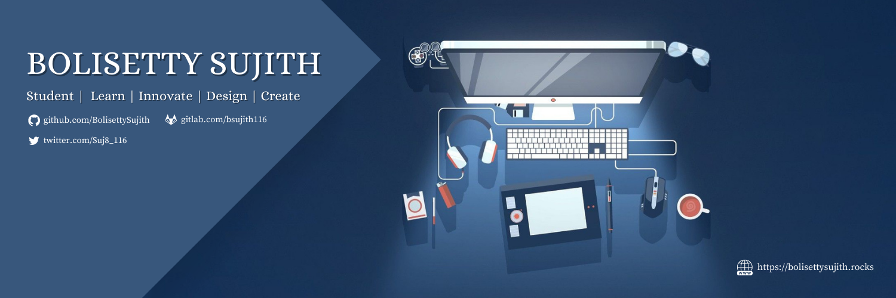

 

</a>

  <h1>Hello coders, I'm Sujith!  </h1>

 
   

## About Me😇

- 🏫 I'm a Computer Science(AI) Undergraduate(2020-2024)

- 🧍‍♂️ I'm currently an active member at [amFOSS](http://www.amfoss.in)

- 💻 I'm currently exploring 💠 Flutter app's development

- 💬 Ask me about :  Java, 🐍Python, Flutter, 🎨Designing, 🎸Acoustic guitar, 💻computers😅

- 🗣 Pronouns: He/His/Him

- 😁 Fun fact :  I had built a voice assistant which helps me in doing some small tasks and it supports only for windows, but I use windows rarely.   

## Skills👨‍💻
<table>
  

    
    
    
    
    
    
    
    
    
    
    
    
    
    
  

</table>

<table>
  <tr>
    <td>
      
    </td>
    <td>
      
    </td>
  </tr>
</table>

## Recent projects😉

 
  
 

